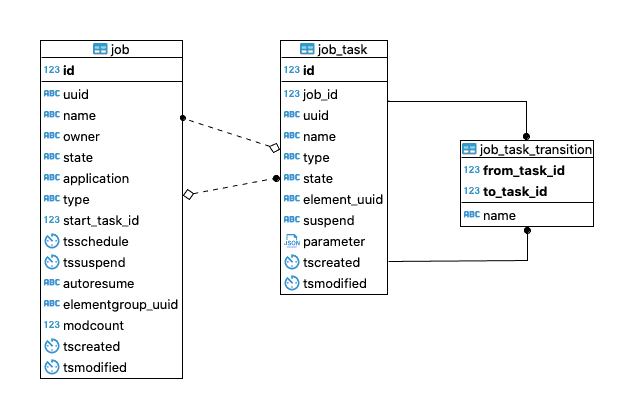

# Leitstand Job Model

This document describes the data model of the _Leitstand Job Scheduler_ database,
which is a relational database. 

All _Leitstand Job Scheduler_ database tables are located in the `job` schema.

## Tables

### Entity-Relationship Model

 

The `job` table contains the configured jobs.
The `job_task` table contains the job task.
A job task is assigned to a job and cannot exist without job.
The job knows its start task and each task is aware of the job it is part of.
The `job_task_transition` table contains all transition connecting the tasks to form the task flow.

### `job` Table 
The `job` table stores all scheduled, active and terminated jobs.

#### Columns

| Column            | Type          | Description                                                                                     |
|:------------------|---------------|-------------------------------------------------------------------------------------------------|
| ID	            | INT8          | Contiguous number as primary key.                                                               |
| UUID	            | CHARACTER(36) | Unique job ID in UUIDv4 format.                                                                 |
| NAME	            | VARCHAR(128)  | Descriptive job name.                                                                           |
| OWNER             | VARCHAR(64)   | User account ID of the job owner.                                                               |
| STATE             | VARCHAR(16)   | The job state.                                                                                  |
| APPLICATION       | VARCHAR(128)  | The Leitstand application that processes this job.                                              |
| TYPE              | VARCHAR(128)  | Job type to categorize a job.                                                                   | 
| START_TASK_ID     | INT8          | Reference to the start task.                                                                    |
| TSSCHEDULE        | TIMESTAMP     | Job execution date.                                                                             |
| TSSUSPEND         | TIMESTAMP     | Job suspension date when the job tasks are not completed by then.                               |
| AUTORESUME        | CHARACTER(1)  | Whether to resume a suspended job at the same time on the next day.                             |
| ELEMENTGROUP_UUID | CHARACTER(36) | UUID of the element group the job was created for. Only set for jobs bound to an element group. |
| MODCOUNT          | INT4          | Modification counter.                                                                           |
| TSMODIFIED        | TIMESTAMP     | Last-modification timestamp.                                                                    |
| TSCREATED         | TIMESTAMP     | Creation timestamp.                                                                             |

The following job states exist:
- `NEW`, a job draft that is not eligible for execution.
- `READY`, a job eligible for execution.
- `ACTIVE`, a job in progress.
- `COMPLETED`, a completed job.
- `CANCELLED`, a cancelled job.
- `FAILED`, a failed job.
- `TIMEOUT`, a timed out job.

#### Primary Key
The `ID` column forms the primary key.

#### Unique Constraints
The `UUID` column must be unique.

#### Foreign Keys
The `job` table has a single foreign key.
The `START_TASK_ID` column refers to the process start task, which is the first task being executed.

### `job_task` Table
The `job_task` tables contains the tasks for each job.
A task cannot exist without the job it belongs to.

#### Columns

| Column       | Type          | Description                                                                                                                               |
|:-------------|---------------|:------------------------------------------------------------------------------------------------------------------------------------------|
| ID           | INT8          | Contiguous number as primary key.                                                                                                         |          
| JOB_ID       | INT8          | Reference to the job record.                                                                                                              |
| UUID         | CHARACTER(36) | Unique task ID in UUIDv4 format.                                                                                                          |
| NAME         | VARCHAR(128)  | Descriptive task name.                                                                                                                    |
| TYPE         | VARCHAR(128)  | Task type to categorize tasks.                                                                                                            |
| STATE        | VARCHAR(16)   | Task state.                                                                                                                               |
| ELEMENT_UUID | CHARACTER(36) | Optional element UUID of the element on which this task gets executed. `NULL` if task is not applied to an element.                       |
| SUSPEND      | CHARACTER(1)  | Whether to suspend the job after successful task completion (Y) or not (N). Y for the first task of each type when canary mode is enabled.| 
| PARAMETER    | JSON          | The task parameter as JSON object.                                                                                                        |
| TSMODIFIED   | TIMESTAMP     | Last-modification timestamp.                                                                                                              | 
| TSCREATED    | TIMESTAMP     | Creation timestamp.                                                                                                                       |

#### Primary Key
The `ID` column forms the primary key.

#### Unique Constraints
The `job_task` tables has two unique constraints.
- The `UUID` column must be unique.
- The combination of `JOB_ID` and `NAME` column values must be unique, i.e. the task name is unique per job.

#### Foreign Keys
The `JOB_ID` column refers to the `ID` column in the `job` table. 
This relation assigns a task to its job.

### `job_task_transition` Table

#### Columns
| Column       | Type         | Description                             |
|:-------------|--------------|:----------------------------------------|
| FROM_TASK_ID | INT8         | Reference to the transition start task. |
| TO_TASK_ID   | INT8         | Reference to the transition end task.   |
| NAME         | VARCHAR(128) | Optional descriptive transition name.   |

#### Primary Key
The `FORM_TASK_ID` column and the `TO_TASK_ID` column form a composie primary key.

#### Foreign Keys
The `job_task_transition` table has two foreign keys:

- The `FORM_TASK_ID` column refers to the transition start task record.
- The `TO_TASK_ID` column refers to the transition end task record.

